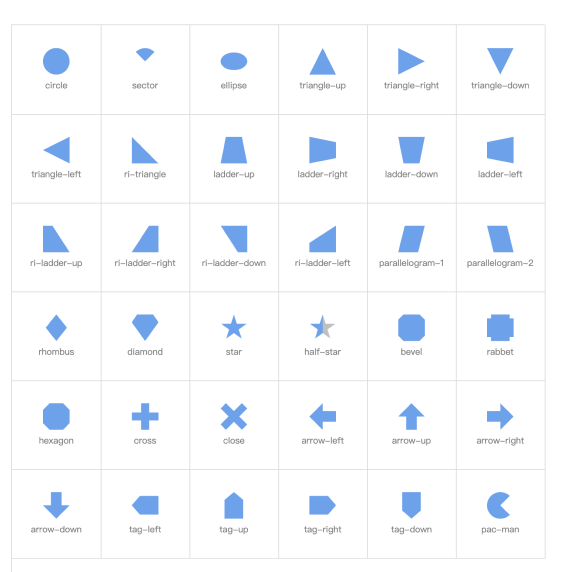

# vue3-shape    
> Simple and easy-to-use css graphic components, completely drawn by clip-path. no dependencies. Applicable to vue3     

### [中文](README.md) | [English](README-EN.md)    

# [preview online](https://cirolee.github.io/vue3-shape/)   

<div style="display: flex; justify-content: center"></div>

# install
pnpm     
```shell
pnpm install vue3-shape
```
npm     
```shell
npm install vue3-shape
```
yarn     
```shell
yarn install vue3-shape
```

# use     

Global use
```javascript
// main.ts
import { createApp } from 'vue';
import App from './App.vue';
import ShapeComponent from 'vue3-shape';

createApp(App).use(ShapeComponent).mount('#app');

// use in sfc
// xxx/app.vue
<template>
  <div>
     <shape type="circle" :size="20" color="red" />
  </div>
</template>

// abrove will render a circle that it's tadius is 20px and fill witch red color;
```    
Import Directly
```javascript
<script lang="ts" setup>
import { Shape } from 'vue3-shape';

</script>

<template>
  <div>
     <shape type="circle" :size="20" color="red" />
  </div>
</template>
```

